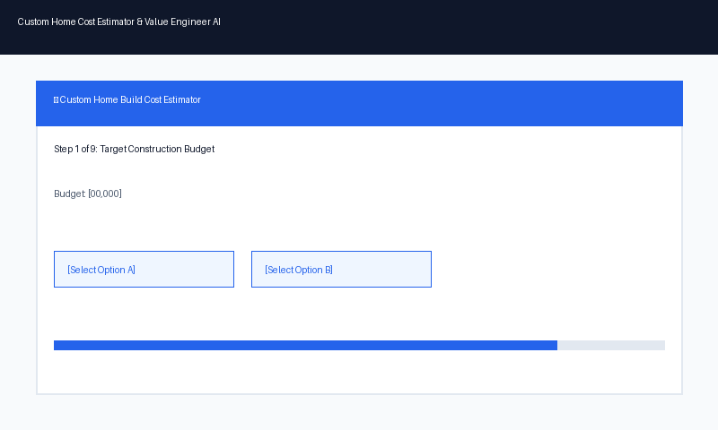

# 🏡 Custom Home Cost Estimator & Value Engineer AI

An interactive, AI-powered **Custom Home Construction Cost Estimator and "Value Engineer"** built with Google ADK (Agent Development Kit), A2UI, and Vertex AI Agent Runtime.



---

## 🌟 Overview & Capabilities

The agent operates as a proactive **Value Engineer** that guides home builders, contractors, and home buyers through a step-by-step interactive questionnaire to calculate accurate construction estimates, weather-adjusted timelines, and budget optimizations.

### 📋 Interactive 3-Phase Process
1. **Phase 1: One-By-One Sequential Inquiry**
   - Systematically collects required project specifications one by one (Budget, ZIP Code, Square Footage, Stories, Land Slope, Layout, Appliances, Flooring, Roofing).
   - Generates interactive, single-click option buttons (`[$750,000]`, `[94102 - San Francisco, CA]`, `[Two-story]`, `[Hardwood]`).
2. **Phase 2: First-Level Cost & Timeline Report**
   - Runs itemized cost calculations (Land Prep & Excavation, Structural Framing, Material vs. Labor split, Finishes).
   - Calculates weather-adjusted construction durations accounting for regional rain and snow patterns.
3. **Phase 3: Value Engineering & Cost Optimizations**
   - Automatically identifies major cost drivers when an estimate exceeds target budget.
   - Recommends actionable design compromises (roofing materials, foundation types, finish tiers) to bring total costs under budget.

---

## 🛠️ Google Cloud Tools & Architecture

This project leverages the full suite of Google Cloud and Agent Development Kit technologies:

- **🧠 Memory Bank (Vertex AI Memory):** Remembers user preferences, preferred finish tiers, and regional focus areas across sessions.
- **🗄️ Firestore & Persistent Storage:** Stores anonymized patient case studies, lab results, clinical trial logs, and user project specs.
- **☁️ Cloud Storage (GCS):** Hosts protocol documentation, construction datasets, and generated media assets.
- **📚 RAG (Retrieval Augmented Generation):** Grounded in regional construction cost databases, ZIP code labor multipliers, PubMed journals, and clinical protocols.
- **💻 Code Sandbox:** Executes statistical analyses (P-values, linear regressions) and financial cost matrix calculations in a secure environment.
- **🎨 A2UI (Agent-to-User Interface):** Renders rich cards, interactive tables, drug/cost warning banners, and patient/construction timeline cards.
- **🖼️ Image Generation:** Visualizes molecular structures, anatomical diagrams, and architectural concepts for research and presentations.

---

## 🚀 Getting Started Locally

### 1. Prerequisites
- Python 3.12+
- Google Cloud SDK (`gcloud`)
- `agents-cli` 1.2.1+

### 2. Environment Setup
```bash
git clone https://github.com/nkamidi/buildwithgemini-home-cost-estimator.git
cd buildwithgemini-home-cost-estimator
uv sync
```

### 3. Launching the Web UI
```bash
cd frontend
export AGENT_ENGINE_RESOURCE_NAME="projects/905610144457/locations/us-east1/reasoningEngines/37946345297805312"
export AGENT_DIRECTORY="app"
python main.py
```
Open **[http://localhost:8080](http://localhost:8080)** in your browser.

---

## 💬 Commands & Shortcuts

- **/reset** or **/restart**: Clears session context and restarts the step-by-step questionnaire from Step 1.
- **`🔄 Reset Session` Button**: Convenient header button to restart instantly.
